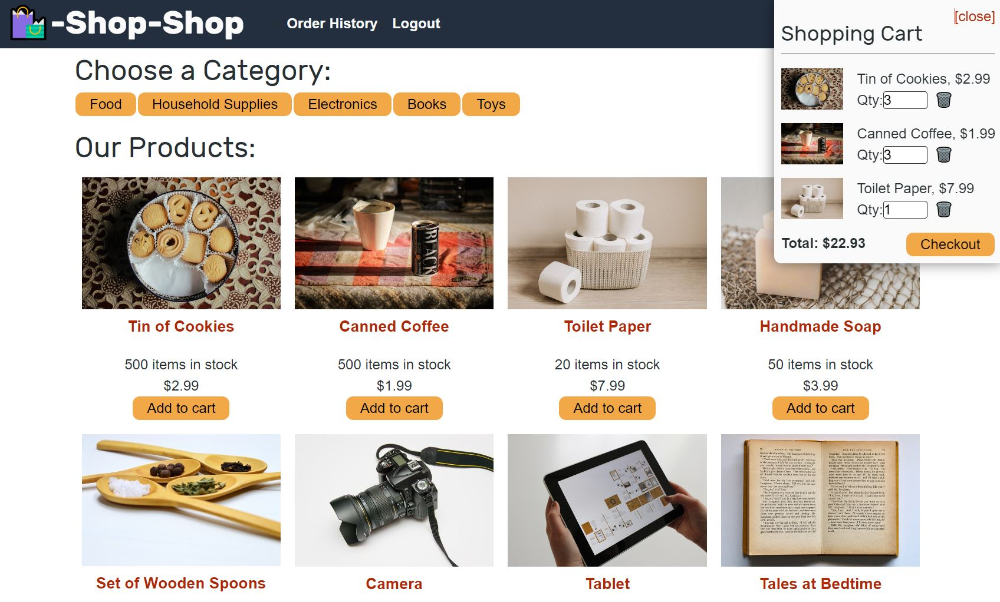
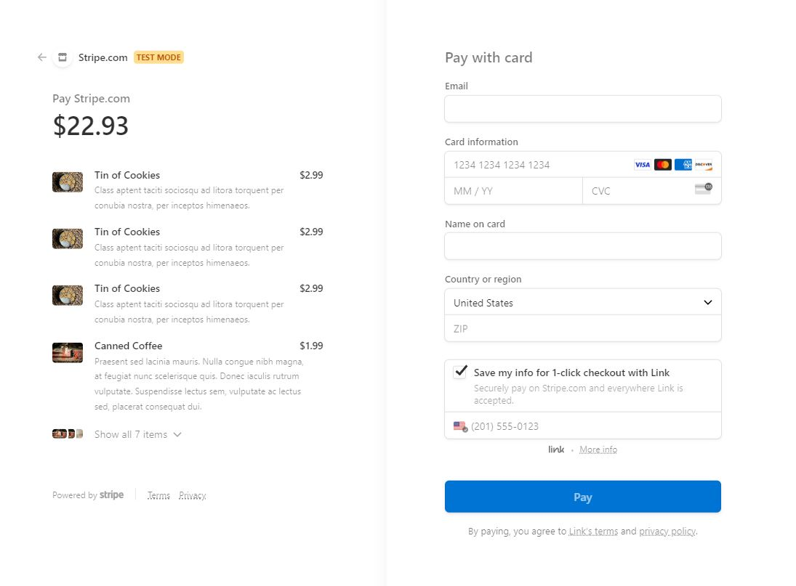

# E-Commerce Store 

## Description:

&nbsp; This app is a feature-rich e-commerce application that applied various technologies and frameworks to ensure a seamless user experience and robust functionality. One of the key skills utilized was Redux, a powerful state management library. By incorporating Redux into the application, it efficiently manages the global state, allowing data flow and synchronization across different components. Redux hooks, such as useDispatch and useSelector interact with the global store, update state, and trigger actions. This approach provides a structured and scalable solution for managing complex application states. Additionally, Stripe, a widely-used payment processing platform, has been integrated into the application. This allows users to securely make purchases and complete transactions. By utilizing the Stripe API and its client library, the necessary logic is included to handle checkout processes, including generating payment sessions and redirecting users to the Stripe Checkout page. This seamless integration of Stripe not only ensures a secure payment experience but also enhances the overall professionalism and credibility of the e-commerce application.

Overall, my development of this application demonstrated proficiency in Redux for state management and the integration of Stripe for secure and reliable payment processing. These skills, coupled with additional understanding of GraphQL, React, web development and other technologies, have enabled me to create a robust e-commerce application that provides an intuitive user interface, efficient state management, and secure payment transactions.

## Table of Contents:

- [Installation](#installation)
- [Usage](#usage)
- [Tests](#tests)
- [Badges](#badges)
- [How_to_Contribute](#how_to_contribute)
- [Questions](#questions)
- [License](#license)

## Installation:

&nbsp; 1. Start by opening a terminal or command prompt and navigating to the directory where the code is located.<br>
&nbsp; 2. Run 'npm i' to install the required packages.<br>

```
npm i
```

## Usage:

&nbsp; The website can be found at: https://arishorts-e-commerce-store.herokuapp.com/
<br>
&nbsp; The github can be found at: https://github.com/arishorts/E-Commerce-Store




If github installation is desired, after completing the installation steps, continue here: <br>

3. Run 'npm run develop' to start the server and run the application

```
npm run develop
```

4. Finally, the respective page will display in your browser

## Tests:

&nbsp; No

## Badges:


## How_to_Contribute:

&nbsp; If you would like to contribute, refer to the [Contributor Covenant](https://www.contributor-covenant.org/)

## Questions:

&nbsp; My GitHub profile can be found at: https://github.com/arishorts
<br>&nbsp; Reach me with additional questions at : arieljschwartz@gmail.com

## License:

&nbsp; http://choosealicense.com/licenses/mit/

---

© 2022 Ariel Schwartz LLC. Confidential and Proprietary. All Rights Reserved.
